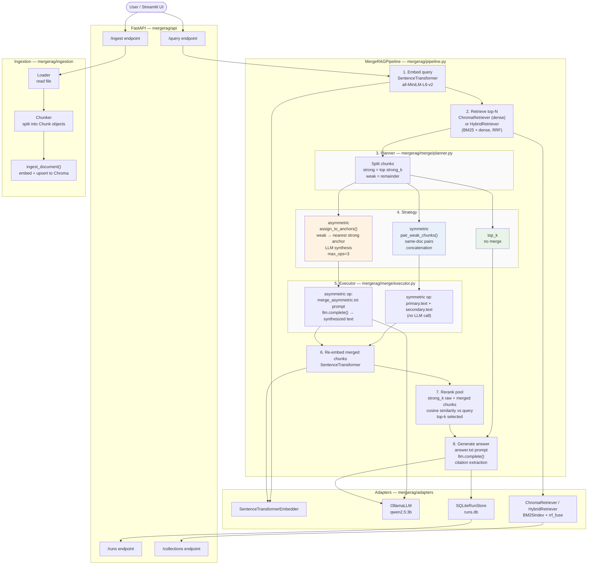

# MergeRAG

A retrieval-augmented generation system that merges retrieved chunks before passing them to the language model. The core idea is that individual retrieved chunks are often weak in isolation — pairing or anchoring them before generation can produce a tighter, more relevant context window.

## How it works

When a query arrives, MergeRAG embeds it, retrieves the top-N candidates, then decides how to merge them based on the chosen strategy. The merged pool gets re-embedded and reranked against the original query before the final context is handed to the LLM for answer generation.

**Retrieval** can use `ChromaRetriever` (dense cosine search only) or `HybridRetriever` (BM25 sparse + Chroma dense, fused via Reciprocal Rank Fusion). Hybrid retrieval fixes entity-name recall gaps where dense similarity alone fails — e.g. a query for "Scott Derrickson nationality" that the dense arm misses is surfaced at rank 2 by the BM25 arm.

**Three merge strategies** are supported. `top_k` is the plain baseline — no merging, just the highest-scoring chunks. `symmetric` pairs weak chunks from the same document together via concatenation. `asymmetric` anchors each weak chunk to its nearest strong same-doc chunk and synthesizes them with a dedicated LLM call, capped at three operations to bound latency.

On HotpotQA (n=500, qwen2.5:3b), asymmetric beats the top_k baseline by +1.0 EM and +1.1 F1 at roughly 42% latency overhead. Symmetric slightly underperforms — adjacent same-doc chunks tend to be topically adjacent but not complementary, producing noisier merged context.

## Architecture



## Project layout

```
mergerag/
  core/           models, ports, utils
  ingestion/      loader, chunker, ingest
  merge/          planner, executor, strategies/
  adapters/       embedder, llm, retriever, sqlite stores
  eval/           benchmark orchestrator, scorer
  api/            FastAPI app and routes
app/
  streamlit_app.py
  api_client.py
  helpers.py
scripts/
  benchmark_cli.py
  ingest_cli.py
  profile_latency.py
data/
  hotpotqa_dev_distractor.json
  chroma/
results/
  hotpot_dev_500.json
  benchmark_findings.md
```

## Setup

You need Python 3.11+, [uv](https://github.com/astral-sh/uv), and [Ollama](https://ollama.com) running locally with `qwen2.5:3b` pulled.

```bash
uv sync
ollama pull qwen2.5:3b
```

## Running

Start the API server:

```bash
uv run uvicorn mergerag.api.app:app --reload
```

Start the Streamlit UI (runs all three strategies side-by-side):

```bash
uv run streamlit run app/streamlit_app.py
```

Ingest a document:

```bash
uv run python scripts/ingest_cli.py \
  --path path/to/doc.txt \
  --collection my_collection \
  --persist-path data/chroma
```

Run the benchmark:

```bash
uv run python scripts/benchmark_cli.py \
  --fixture data/hotpotqa_dev_distractor.json \
  --collection hotpot_dev_500 \
  --limit 500 \
  --persist-path data/chroma \
  --output results/hotpot_dev_500.json
```

Profile per-stage latency:

```bash
uv run python scripts/profile_latency.py --n 100
```

Run tests:

```bash
uv run pytest
```

## Configuration

The API server reads these environment variables, all optional:

`CHROMA_PERSIST_PATH` — path to a persisted Chroma index (default: ephemeral).  
`RUN_STORE_PATH` — SQLite path for run traces (default: `runs.db`).  
`EMBEDDING_MODEL` — SentenceTransformer model name (default: `all-MiniLM-L6-v2`).  
`OLLAMA_MODEL` — Ollama model name (default: `qwen2.5:3b`).  
`DEFAULT_TOP_N` — candidates retrieved before merging (default: 20).  
`DEFAULT_TOP_K` — final context window size (default: 5).  
`DEFAULT_STRONG_K` — strong anchor count for merge planning (default: 5).

## Dataset and evaluation

All benchmarks were run on the HotpotQA distractor setting — a multi-hop QA dataset where each question comes with ten candidate paragraphs (only two of which are actually supporting), making it a good stress test for retrieval and context selection. We used the first 500 examples from the development set.

The asymmetric strategy is where merging pays off most visibly. These are the kinds of questions it got right when top_k failed:

- *Kaiser Ventures corporation was founded by an American industrialist who became known as the father of modern American shipbuilding?* — asymmetric correctly returned **Henry J. Kaiser** by anchoring the Kaiser Ventures chunk to the Kaiser Shipyards chunk. top_k returned the company name.
- *The Livesey Hall War Memorial commemorates the fallen of which war, that had over 60 million casualties?* — asymmetric returned **World War II**; top_k returned World War I. The second hop (casualty count) was only recoverable once the two supporting paragraphs were merged.
- *What material did a hairdresser from Yorkshire, England invent that was named by his granddaughter?* — asymmetric returned **Starlite** by connecting the inventor biography chunk to the material description chunk. top_k hallucinated "Eaglebeak."
- *Which film was released first: Sacred Planet or Oz the Great and Powerful?* — a comparison question where asymmetric correctly returned **Sacred Planet** by synthesizing release date information spread across two chunks.
- *The city that contains the Yunnan Provincial Museum is also known by what nickname?* — asymmetric returned **Spring city** after anchoring the museum location chunk to the city overview chunk. top_k could not bridge the two.

Across the 500-example run, asymmetric flipped 13 questions from wrong to right that top_k got incorrect, while the baseline strategy never had access to merged context to make those connections.

### Reference

Yang, Z., Qi, P., Zhang, S., Bengio, Y., Cohen, W. W., Salakhutdinov, R., & Manning, C. D. (2018). HotpotQA: A Dataset for Diverse, Explainable Multi-hop Question Answering. *Proceedings of the 2018 Conference on Empirical Methods in Natural Language Processing (EMNLP)*. https://arxiv.org/abs/1809.09600
